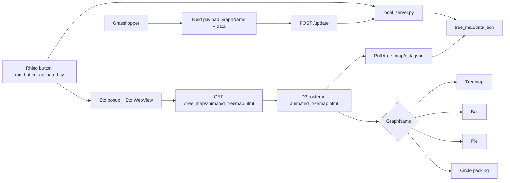

# Rhino 8 Web Graph Prototype

Rhino + Eto + Grasshopper workflow for live D3 chart visualization in an embedded web view.

## Folder overview

- `grasshopper/`
  - Grasshopper-side files and data exports while preparing payloads.
  - Optional at runtime; live app reads `tree_map/data.json`.
- `scripts/`
  - Rhino Python entry points and server logic.
  - `run_button_animated.py` opens local chart mode and auto-starts server.
  - `ui_popup.py` creates Eto UI and embeds `Eto.Forms.WebView`.
  - `local_server.py` serves files and handles `POST /update`.
- `tree_map/`
  - Frontend assets used by Eto WebView.
  - `animated_treemap.html` contains D3 chart renderers and chart switching.
  - `data.json` is the active live payload file.

## Three layers that work together

1. **UI layer (Rhino + Eto)**
   - Rhino button opens `ui_popup.py`.
   - Popup uses `Eto.Forms.WebView` to load:
     - external URL mode, or
     - local chart mode (`http://127.0.0.1:8765/tree_map/animated_treemap.html`).

2. **Web layer (HTML + D3)**
   - `tree_map/animated_treemap.html` fetches `tree_map/data.json` every ~700ms.
   - It routes rendering by `GraphName`:
     - `GraphName.TREEMAP`
     - `GraphName.BAR_GRAPH`
     - `GraphName.PIE`
     - `GraphName.CIRCLE_PACKING`

3. **Data layer (Grasshopper + local server)**
   - Grasshopper builds payload and sends to `POST /update`.
   - `scripts/local_server.py` normalizes payload and writes `tree_map/data.json`.
   - Web layer detects changes and re-renders.

## Workflow

1. Run:
   - `_-RunPythonScript "C:\Users\Matea.Pinjusic\Documents\datacharts\scripts\run_button_animated.py"`
2. `run_button_animated.py` checks server health and starts `local_server.py` if needed.
3. Eto popup opens Local mode and loads `animated_treemap.html`.
4. Grasshopper sends payload updates to:
   - `http://127.0.0.1:8765/update`
5. Server writes latest payload to:
   - `tree_map/data.json`
6. HTML polls `tree_map/data.json`, compares hash, and re-renders when changed.

### Expected payload

```json
{
  "GraphName": "GraphName.TREEMAP",
  "data": [
    { "name": "A", "parent": "Group", "value": 100 },
    { "name": "B", "parent": "Group", "value": 60 }
  ]
}
```

### Workflow diagram


